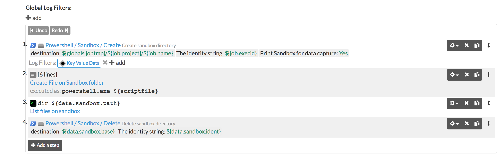

# powershell-sandbox-directory
Workflow steps to manage a sandbox directory for working files

## Configuration

* **Destination**: The base directory where the sandbox folder will be created. If the path has subfolders, it will create them recursively in case they don't exist. You can use global and job environments, eg: `${globals.path}/${job.project}/${job.name}`
* **Ident**: The sandbox folder name. The full path of the sandbox directory will be `destination/ident`. You can also use job environments like `${job.execId}`
* **Print**: Print the sandbox info on "Data-passing" format. With this, you can add a "Key Value Data" filter to pass the sandbox info to the next steps on the workflow.

